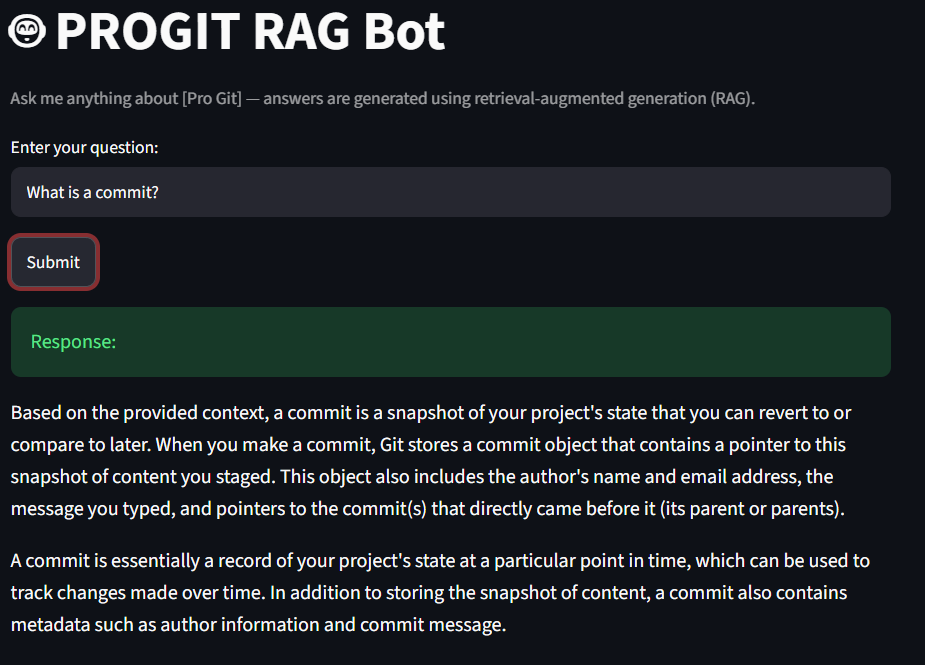

# 🤖 ProGit RAG Bot

An AI-powered assistant that lets you chat with the **Pro Git** book using **Retrieval-Augmented Generation (RAG)**. The application performs semantic search over the book and uses a local Large Language Model (LLM) to generate accurate, context-aware answers.

> **100% Local • Private • Offline Ready**

---

## 📷 Demo

Here is the application in action.



---

## 📖 Overview

Searching through technical documentation can be time-consuming. **ProGit RAG Bot** allows you to ask questions in natural language and receive answers based solely on the contents of the **Pro Git** book.

Instead of relying only on an LLM's internal knowledge, the application retrieves the most relevant sections of the book and provides them as context before generating a response. This Retrieval-Augmented Generation (RAG) approach helps reduce hallucinations and improve answer accuracy.

---

## ✨ Features

- Semantic similarity search using vector embeddings
- Retrieval-Augmented Generation (RAG)
- Context-aware answer generation
- Interactive Streamlit web interface
- FastAPI backend
- Local Llama 3 inference with Ollama
- 100% local and privacy-friendly
- Offline support

---

## 🛠 Tech Stack

| Component | Technology |
|------------|------------|
| Backend | FastAPI |
| Frontend | Streamlit |
| LLM | Ollama (Llama 3) |
| Embeddings | Ollama Embeddings |
| Framework | LangChain |
| Vector Database | ChromaDB |
| Language | Python |
| Package Manager | uv |

---

## 📂 Important Files

| File | Description |
|------|-------------|
| `app/core/ingestion.py` | Reads the Pro Git PDF, splits it into chunks, generates embeddings, and builds the Chroma vector database. |
| `app/core/retrieval.py` | Performs semantic search and retrieves the most relevant document chunks. |
| `app/core/llm_logic.py` | Creates the prompt from the retrieved context and generates the final answer using Llama 3. |
| `app/main.py` | FastAPI backend. |
| `app/ui.py` | Streamlit frontend interface. |
| `config/settings.py` | Stores project configuration and environment settings. |
| `run_bot.bat` | Starts the backend and frontend with a single click. |

---

## 🌐 Why Local?

Unlike cloud-based AI assistants, **ProGit RAG Bot** runs entirely on your own computer.

### ✅ Privacy

Your documents and questions never leave your machine.

### ✅ Offline Ready

Once the model is downloaded through Ollama, no internet connection is required.

### ✅ Full Control

You own your data, models, and environment.

---

# 🚀 Installation

## 1. Clone the Repository

```bash
git clone https://github.com/Alihmidov/progit-rag-llama-3.git
cd progit-rag-llama-3
```

## 2. Install Dependencies

Using **uv**:

```bash
uv sync
```

## 3. Install Ollama

Download and install Ollama:

https://ollama.com/

Start Ollama before running the project.

## 4. Download the Llama 3 Model

```bash
ollama pull llama3
```

## 5. Build the Vector Database

Process the **Pro Git** book and generate embeddings.

```bash
uv run python app/core/ingestion.py
```

## 6. Start the Application

### Option A — One-Click Launch *(Recommended)*

Simply double-click **`run_bot.bat`**.

The script will automatically:

- Activate the virtual environment
- Start the FastAPI backend
- Launch the Streamlit interface
- Open the application in your default web browser

### Option B — Manual Launch

Start the FastAPI backend:

```bash
uv run uvicorn app.main:app --reload
```

Open a new terminal and launch Streamlit:

```bash
uv run streamlit run app/ui.py
```

---

## 💬 Example Questions

- What is Git?
- How does Git branching work?
- How does Git store objects?
- Explain Git tags.
- How can I undo a commit?
- What is the difference between merge and rebase?

---

## ⚙️ How It Works

1. The **Pro Git** PDF is split into manageable text chunks.
2. Each chunk is converted into a vector embedding.
3. The embeddings are stored in ChromaDB.
4. When a user asks a question:
   - The question is embedded.
   - The most relevant document chunks are retrieved.
   - The retrieved context is provided to Llama 3.
   - Llama 3 generates an answer based on the retrieved context.

---

## 🔮 Future Improvements

- Conversation memory
- Source citations
- Multi-document support
- Hybrid search
- Better retrieval ranking
- Chat history
- Streaming responses
- PDF upload support

---

## 📄 License

This project is intended for educational and learning purposes.

---

## 👤 Author

**Ali Hmidov**

GitHub: https://github.com/Alihmidov